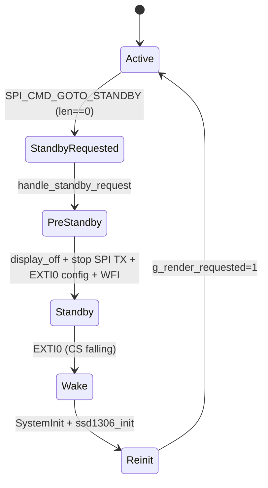

# GOTO_STANDBY (gfx_slave)

## Notes
- Triggered by `SPI_CMD_GOTO_STANDBY` with a zero-length payload (`cmd_goto_standby`).
- No response is sent (`PROTOCOL_RESP_SENT`) to avoid CS timing races.
- The main loop polls `g_request_standby` in `handle_standby_request`.
- `enter_standby_wait_cs_falling` drains I2C DMA, turns the display off,
  stops SPI TX DMA, configures EXTI0 on CS falling edge, sets `SLEEPDEEP`,
  and executes `WFI`.
- Wake path runs `SystemInit`, reinitializes the SSD1306, and requests a render.
  On init failure, it falls back to `ssd1306_set_height(64)` and `ssd1306_clear()`.

## State diagram

