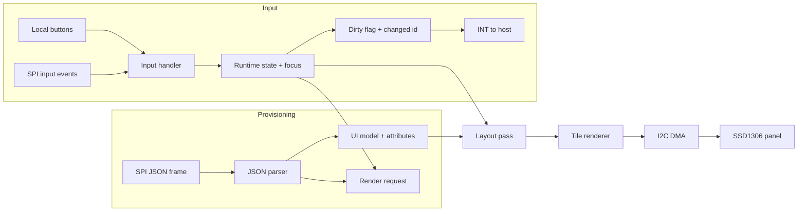
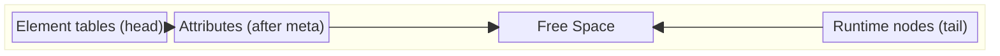
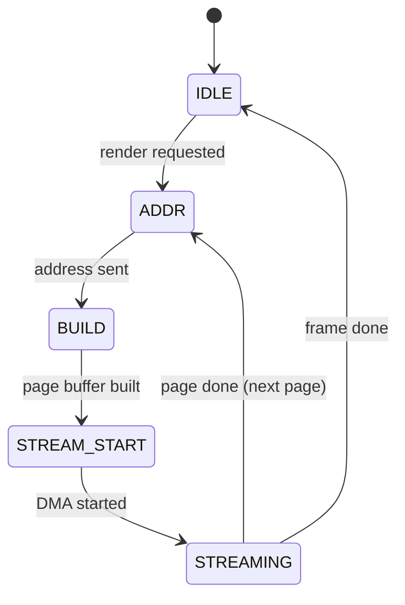
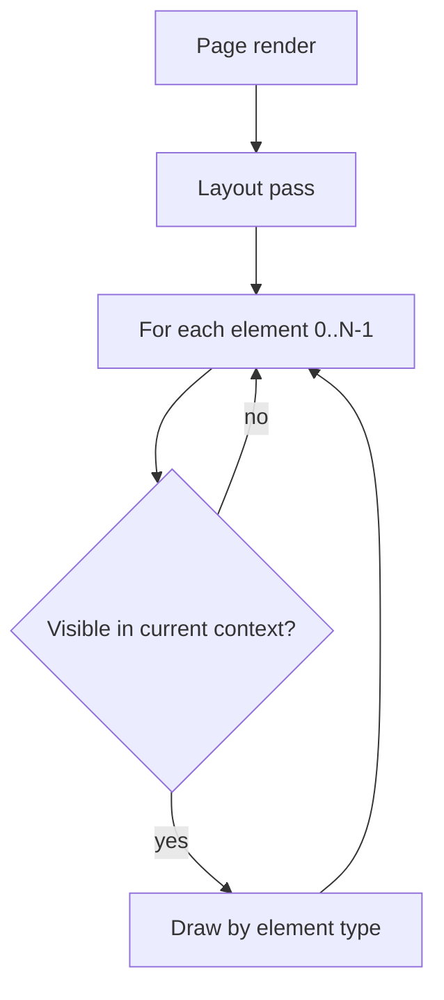
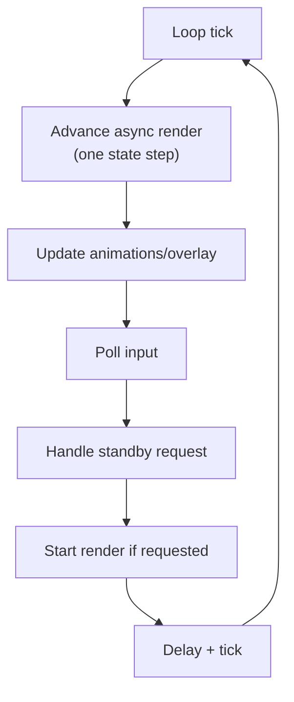

# UI Handling Architecture (gfx_slave)

## Scope
Explains how JSON input becomes UI state, how input is handled, and how
rendering drives the SSD1306 panel.

## Overview

## Data model and memory layout
- Element tables (meta + positions) are reserved at the head of the shared arena.
- Element meta is `type + parent id` (2 bytes per element).
- Attributes are stored after the element tables and grow forward.
- Runtime nodes (lists, triggers, barrels) allocate from the tail of the same arena.
- There is no compaction; text updates must fit the allocated capacity.
- Split rationale: attributes are mostly static, runtime state mutates frequently.
  Separating them avoids frequent rewrites of static data and keeps memory bounded.

### Shared Arena

### Attribute and runtime sizes (budget)
| item | stored in | size |
| --- | --- | --- |
| TEXT attribute | arena head | `3 + cap` bytes (cap includes NUL) |
| Screen role attribute | arena head | `3` bytes |
| Trigger runtime node | arena tail | `4` bytes |
| List runtime node | arena tail | `12` bytes |
| Barrel runtime node | arena tail | `6` bytes |

## Element creation and update
- Each SPI JSON frame carries one element object.
- `JSON_HEAD` resets state; `JSON_COMMIT` marks initialized and requests render.
- A header element (`t=h`, `n=<count>`) is required to reserve per-element tables.
- Create order matters: parents must appear before children.
- Update mode uses element id `e`, ignores structural keys, and ignores mismatched types.
- Text updates succeed only when the new content fits the allocated capacity.

## Input and focus
- Input events are processed on release only.
- While a screen slide animation is active, input is ignored.
- Overlay with `mask_input=1` accepts only OK; other inputs are dropped.
- Focusable types are list, barrel, and trigger; nested navigation uses a stack.
- Input-driven changes set the dirty flag with the most recent element id.
  The host reads and clears it via `GET_STATUS`.

## Async render step (what "advance async render" does)
- One call advances the page state machine by at most one stage.
- If the I2C DMA engine is busy, it returns immediately.
- Stages are fixed: address setup, page build, DMA start, DMA streaming.

## Rendering and traversal
- A layout pass computes final coordinates and clip bounds using scroll and animation state.
- The renderer draws one SSD1306 page at a time using a shared 128-byte buffer.
- Overlay screens render text only and ignore scroll offsets.
- Render requests are coalesced into at most one pending frame.
- The renderer iterates all elements each page and filters by visibility.
  Visibility depends on active screen or the current navigation target.

## Complexity notes
- Layout pass: O(N) per page.
- Rendering: O(N) per page; total O(N * P) per frame (P is page count).
- Focus traversal and list operations use linear scans.
  There is no per-screen index; visibility checks gate the active context.

## Main loop ordering

