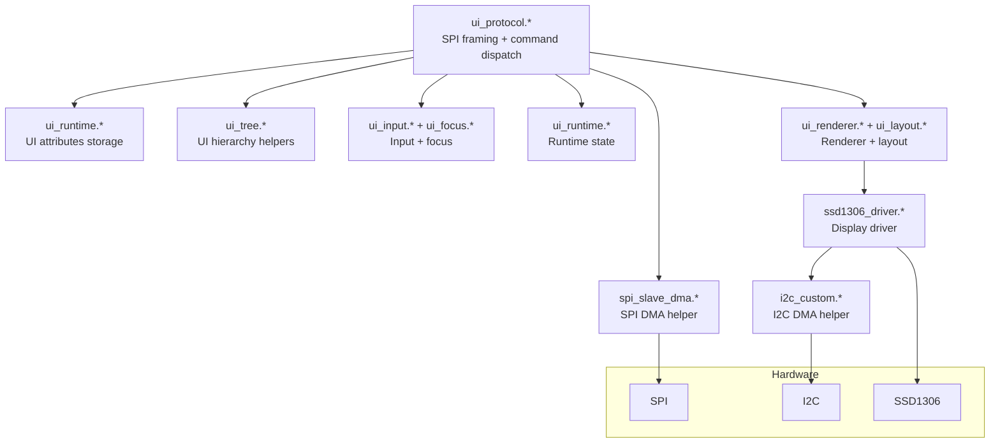

# Component Diagrams

## gfx_slave modules (implementation)

```mermaid
flowchart TB
    Protocol["ui_protocol.*\nSPI framing + command dispatch"] --> Model["ui_runtime.*\nUI attributes storage"]
    Protocol --> Tree["ui_tree.*\nUI hierarchy helpers"]
    Protocol --> Input["ui_input.* + ui_focus.*\nInput + focus"]
    Protocol --> Runtime["ui_runtime.*\nRuntime state"]
    Protocol --> Renderer["ui_renderer.* + ui_layout.*\nRenderer + layout"]
    Renderer --> Driver["ssd1306_driver.*\nDisplay driver"]
    Driver --> I2C["i2c_custom.*\nI2C DMA helper"]
    Protocol --> SPI["spi_slave_dma.*\nSPI DMA helper"]

    subgraph Hardware
      SPIHW[SPI]
      I2CHW[I2C]
      Panel[SSD1306]
    end

    SPI --> SPIHW
    I2C --> I2CHW
    Driver --> Panel
```
