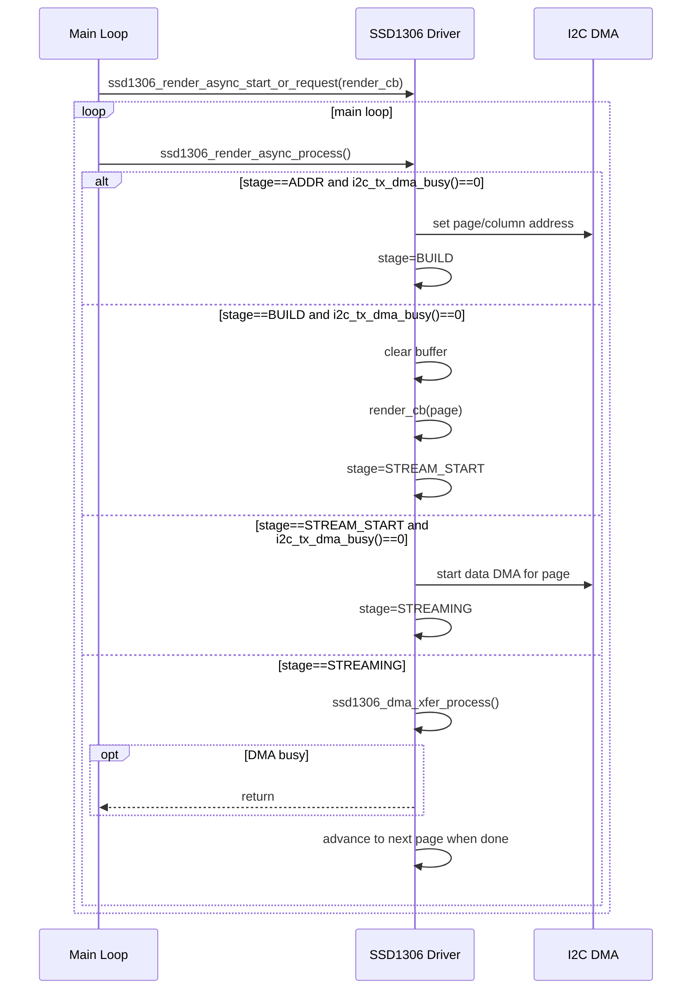

# SSD1306 Driver Overview

## Overview
This driver targets SSD1306 128x32/64 panels on MCUs with tight RAM budgets.
It uses a single 128-byte shared page buffer and a non-blocking I2C DMA state
machine to stream pages while the main loop keeps running.

## Related views
- Component-level: `docs/c4/component/component.md`
- Code-level: `docs/c4/code/ui_architecture.md`

## Design goals
- Fit within 2 KB RAM and 16 KB flash budgets.
- Avoid full-frame buffers.
- Keep CPU usage bounded with cooperative, non-blocking transfers.

## Key components
- **Shared page buffer**: `gfx_shared` provides a 128-byte scratch buffer.
- **Chunked DMA transfer**: `ssd1306_dma_xfer_start/process/active` streams a page
  as a series of small DMA bursts while polling `i2c_tx_dma_busy()`.
- **Async frame state**: `ssd1306_render_async_*` controls per-page rendering and
  page streaming across all pages.
- **Geometry control**: `ssd1306_set_height(32/64)` updates panel geometry and page count.

## Public API surface
Core entry points used by the UI layer:
- `ssd1306_init()`
- `ssd1306_set_height(32|64)`
- `ssd1306_render_async_start_or_request(render_cb)`
- `ssd1306_render_async_process()`
- `ssd1306_render_async_busy()`
- `ssd1306_render_async_request_rerender()`
- `ssd1306_dma_xfer_active()` (low-level diagnostics)
- `ssd1306_get_render_stage()` (ADDR/BUILD/STREAM_START/STREAMING)

## Typical usage
1. Initialize I2C and the panel:
   - `ssd1306_init()`
   - `ssd1306_set_height(32|64)`
2. Provide a render callback that fills the shared buffer for one page.
3. In the main loop:
   - Call `ssd1306_render_async_process()` every iteration.
   - Call `ssd1306_render_async_start_or_request(render_cb)` when a redraw is needed.

## Render flow (page-based)
`ssd1306_render_async_process()` advances a small state machine. Each page passes through:
1. **ADDR**: set column/page address.
2. **BUILD**: clear buffer and call `render_cb(page)` once.
3. **STREAM_START**: start streaming the 128-byte page via DMA.
4. **STREAMING**: wait until all chunks are issued.

The process function returns quickly if the I2C DMA is busy.

### Sequence diagram (async full frame)

## Rerender behavior
- `ssd1306_render_async_start_or_request()` starts a frame if idle.
- If a frame is active, it only sets a **single** rerender flag.
- Multiple requests collapse into one follow-up frame.

## Constraints and notes
- The driver assumes exclusive control of I2C while a frame is streaming.
- There is no internal queue; callers must avoid overlapping I2C traffic.
- The transfer engine is polled, not interrupt-driven.
