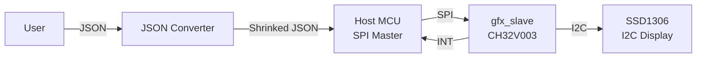
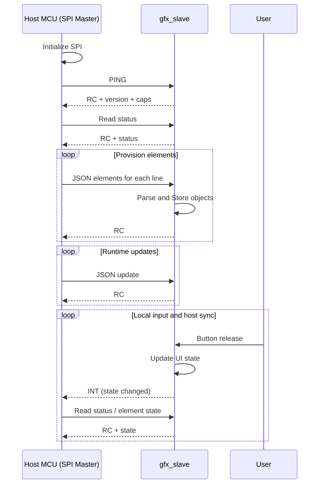

# Context Overview

The system is a SPI-controlled display slave that renders UI on an SSD1306 panel.
A host MCU provisions UI structure; local buttons on the slave drive UI state changes.
When local input updates the UI, the slave notifies the host via an interrupt line,
and the host fetches UI state over SPI.

## External actors
- Host MCU: provisions UI, receives interrupts from the slave, and queries UI state.
- SSD1306 panel: display target (128x32 or 128x64).

# Host Workflow Summary
In order to reduce slave's memory consumption, host shall convert json to predefined format by converter beforehand.

